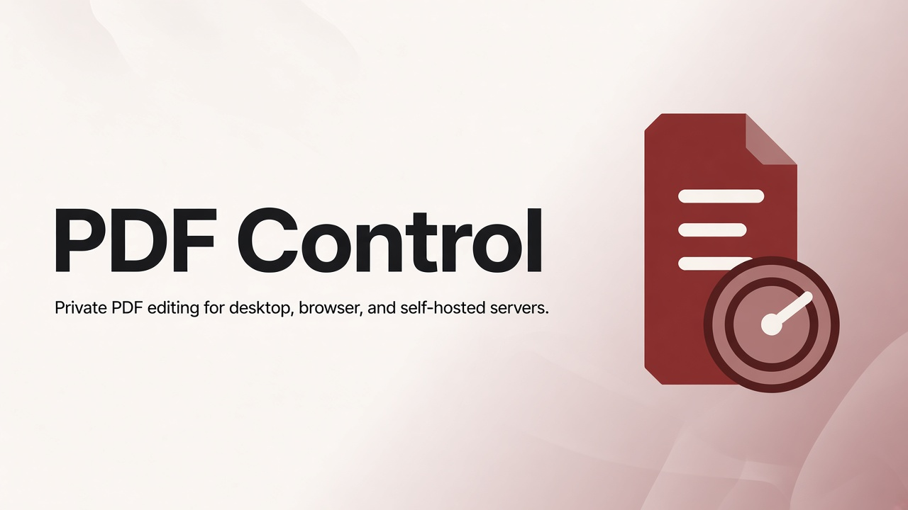
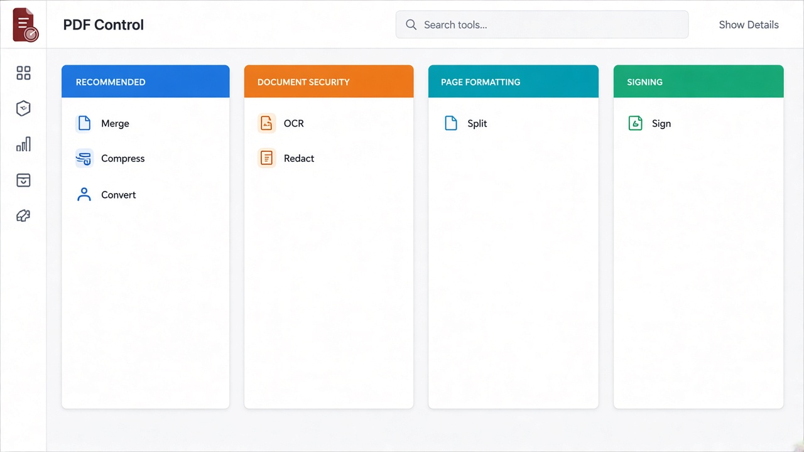
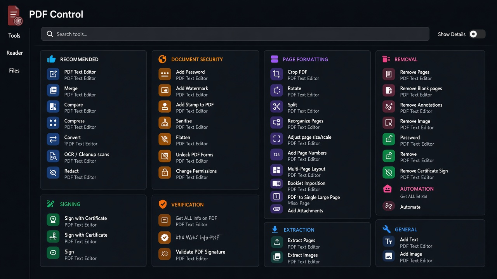
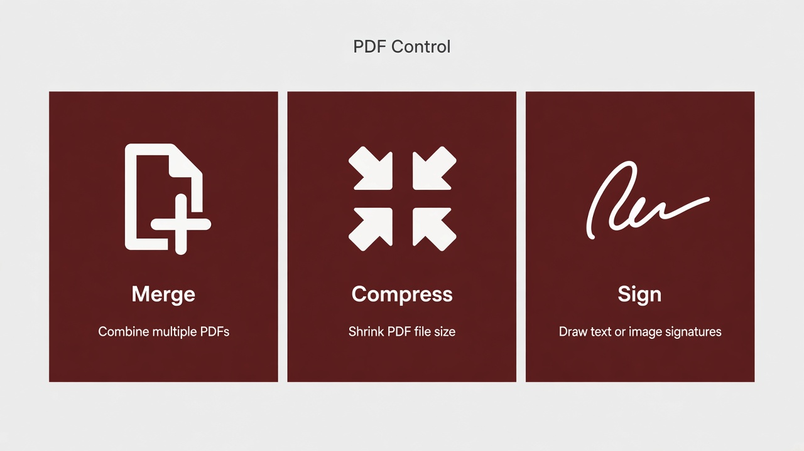

<p align="center">
  
</p>

<h1 align="center">PDF Control</h1>

<p align="center">
  <strong>Private PDF editing for desktop, browser, and self-hosted servers.</strong><br>
  Merge, split, compress, sign, redact, convert, and automate — without sending documents to someone else’s cloud by default.
</p>

<p align="center">
  <a href="https://github.com/MohOneX/PDF-Control/stargazers">
    
  </a>
  <a href="https://github.com/MohOneX/PDF-Control/issues">
    
  </a>
  <a href="LICENSE">
    
  </a>
</p>



## Product preview

| Light | Dark |
| :---: | :---: |
|  |  |



## Why PDF Control

- **Stay in control of your files** — process locally on desktop or on infrastructure you run.
- **50+ PDF tools** — edit, merge, split, sign, redact, convert, OCR, compress, and more.
- **Desktop + web + API** — same platform for interactive work and automated pipelines.
- **Bilingual-ready UI** — language tooling and localization support included (including EN/AR toggle work).
- **Automation** — no-code workflows in the UI, plus REST APIs for integrations.
- **Self-hosted friendly** — Docker and local development via Task.

## Quick start

### Docker

```bash
docker run -p 8080:8080 docker.stirlingpdf.com/stirlingtools/stirling-pdf
```

Open [http://localhost:8080](http://localhost:8080).

### Local development

Requires JDK 25, Node.js, and [Task](https://taskfile.dev/).

```bash
task install
task dev
```

- Backend: `http://localhost:8080`
- Frontend: `http://localhost:5173`

Useful commands:

| Command | Purpose |
| --- | --- |
| `task --list` | List available tasks |
| `task check` | Lint, typecheck, and test |
| `task frontend:dev` | Frontend only |
| `task backend:dev` | Backend only |
| `task desktop:dev` | Desktop (Tauri) development |

See [DeveloperGuide.md](DeveloperGuide.md) for architecture and contribution details.

## Repository

- **GitHub:** [https://github.com/MohOneX/PDF-Control](https://github.com/MohOneX/PDF-Control)
- **Issues:** [https://github.com/MohOneX/PDF-Control/issues](https://github.com/MohOneX/PDF-Control/issues)

## Attribution

PDF Control is based on the open-core [Stirling PDF](https://github.com/Stirling-Tools/Stirling-PDF) project. Upstream branding, docs, and SaaS offerings remain with their respective owners. This repository customizes branding, UI, and local product experience as **PDF Control**.

## License

Open-core. See [LICENSE](LICENSE) for details.
